# Zen MCP Server Architecture

## Executive Summary

The Zen MCP Server is a well-architected system that successfully bridges the stateless MCP (Model Context Protocol) with stateful AI tool orchestration. It employs a clean three-layer architecture (Protocol → Tool → Provider) with strong separation of concerns. While the architecture is solid for single-instance deployments, it faces critical scalability limitations due to its in-memory conversation storage design.

## Core Architecture

### Three-Layer MCP Bridge

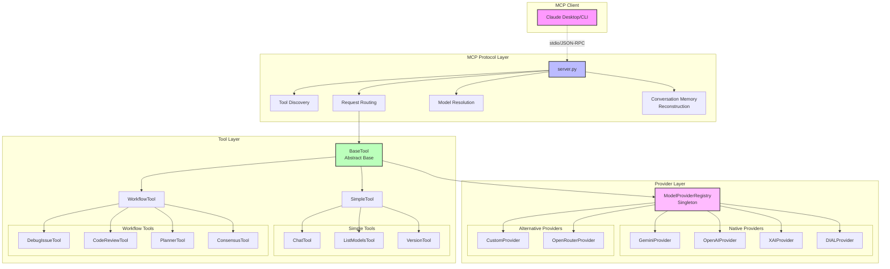

### Request Flow Architecture

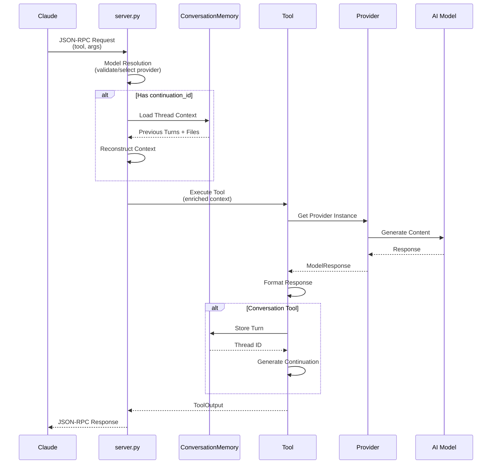

## Critical Architectural Decisions

### 1. Stateless-to-Stateful Bridge

The most significant architectural decision is bridging MCP's stateless protocol with stateful AI conversations:

- **Problem**: MCP treats each request independently
- **Solution**: In-memory conversation storage with UUID-based thread tracking
- **Trade-off**: Enables rich multi-turn conversations but limits horizontal scaling

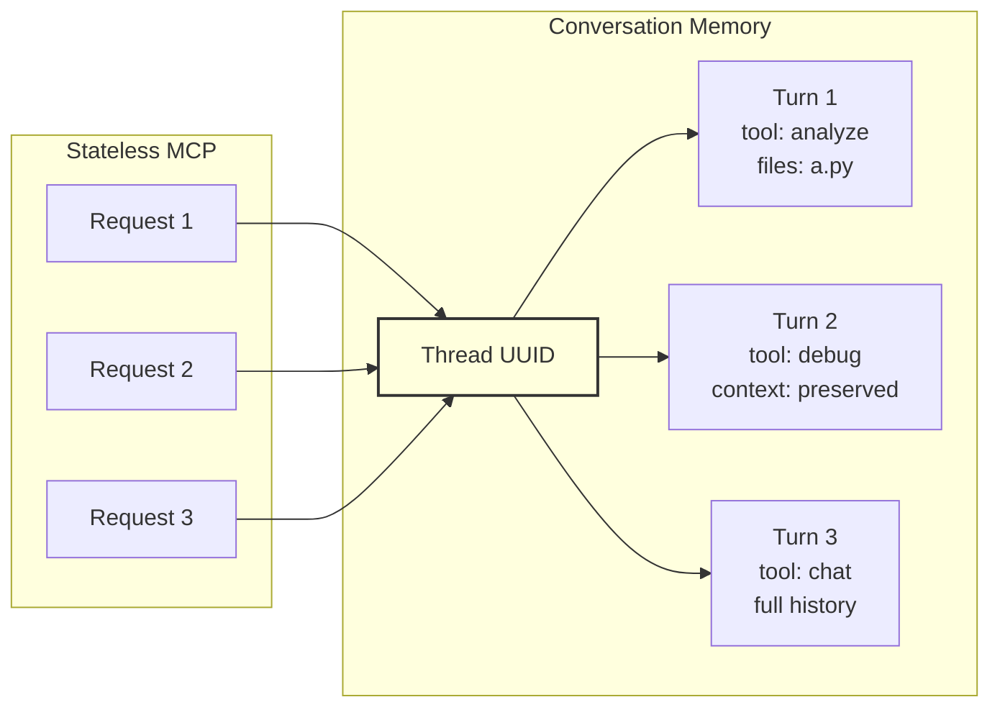

### 2. Tool Abstraction Hierarchy

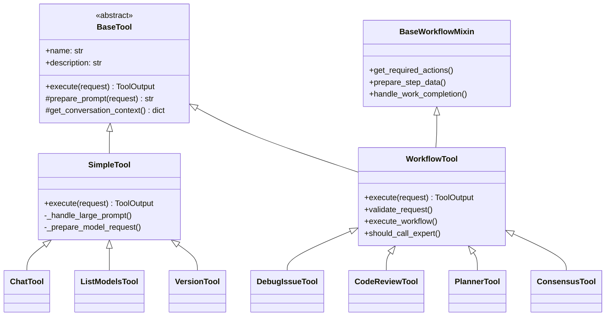

### 3. Provider Priority System

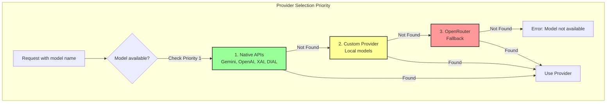

## Key Architectural Patterns

### 1. Singleton Registry Pattern

The `ModelProviderRegistry` uses singleton pattern for global provider management:

```python
class ModelProviderRegistry:
    _instance = None
    
    def __new__(cls):
        if cls._instance is None:
            cls._instance = super().__new__(cls)
            cls._instance._providers = {}
            cls._instance._initialized_providers = {}
        return cls._instance
```

**Benefits**:
- Single source of truth for provider configuration
- Lazy initialization prevents unnecessary API client creation
- Thread-safe provider instance caching

### 2. Conversation Memory Architecture

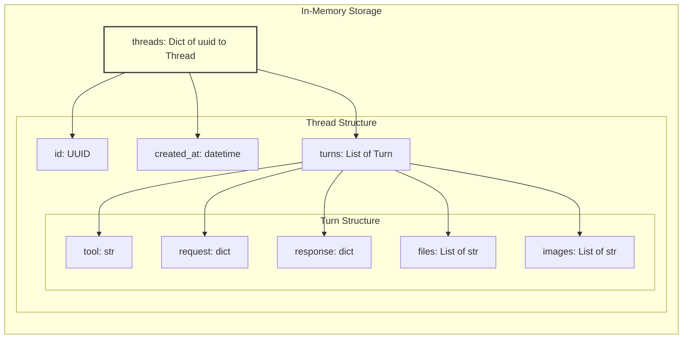

**Key Features**:
- UUID-based conversation thread identification
- Turn-by-turn history with tool attribution
- Cross-tool continuation support
- Newest-first file prioritization
- 20-turn maximum to prevent runaway conversations

### 3. Model Resolution Flow

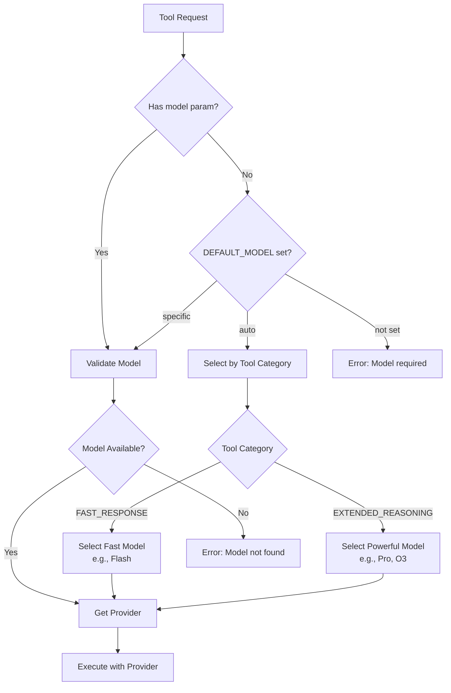

## Architectural Strengths

### 1. Clean Separation of Concerns

- **Protocol Layer**: Handles only MCP communication and routing
- **Tool Layer**: Business logic independent of transport or providers
- **Provider Layer**: Unified interface for diverse AI services

### 2. Extensibility Points

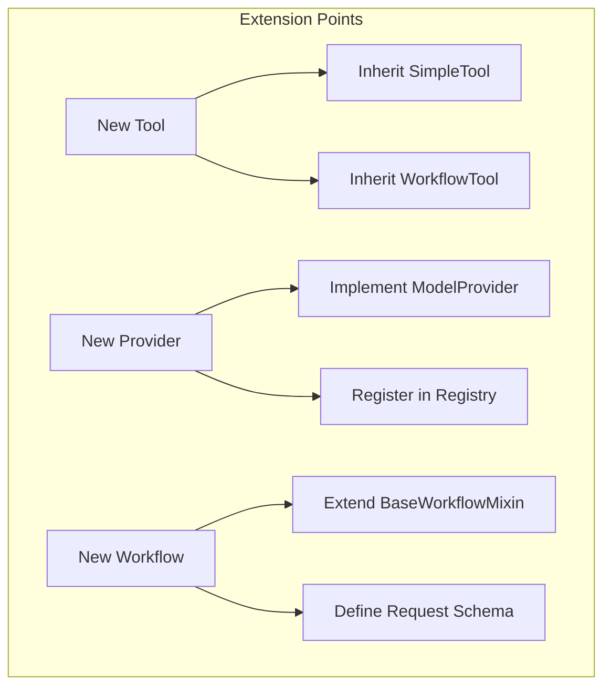

### 3. Developer Experience

- Consistent patterns across all tools
- Comprehensive type hints via Pydantic models
- Rich inline documentation
- Clear error messages with context

## Architectural Weaknesses

### 1. Scalability Bottleneck

**In-Memory Conversation Storage**:
- Cannot scale horizontally (no shared state)
- Data loss on process restart
- No disaster recovery capability

**Impact Analysis**:
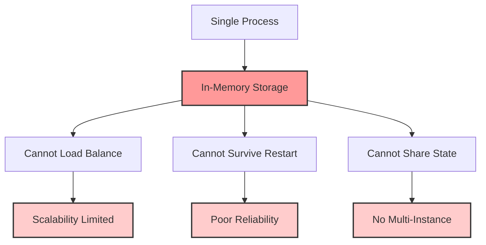

### 2. Complex Inheritance

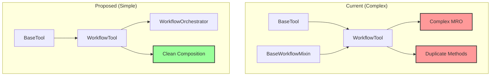

### 3. Configuration Management

**Current State**: Environment variables accessed throughout codebase
**Problems**: No validation, no defaults management, scattered access

## Security & Operational Considerations

### Current Security Model

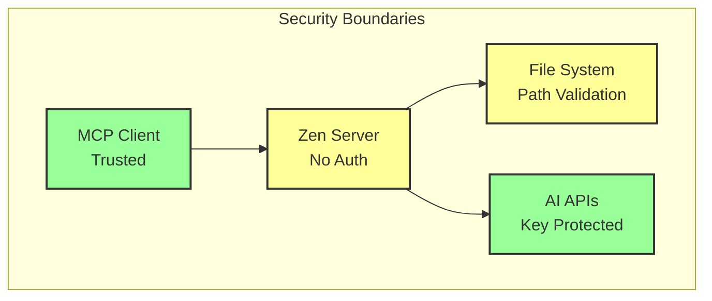

**Gaps**:
- No authentication mechanism
- No rate limiting
- No resource quotas
- File access via path validation only

### Observability

**Current**: Basic logging via Python logging module
**Missing**: Metrics, distributed tracing, health checks

## Performance Characteristics

### 1. Lazy Loading Strategy

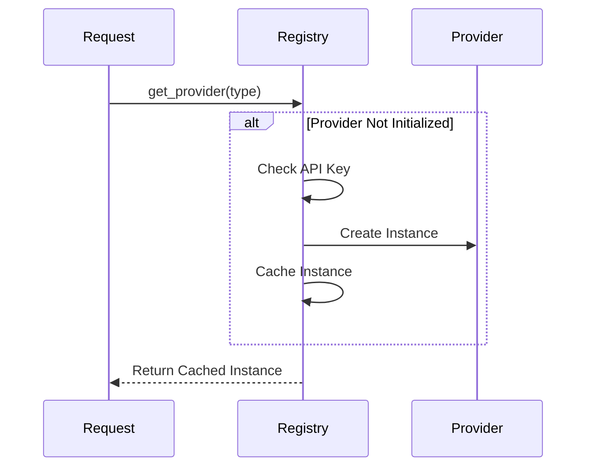

### 2. Connection Pooling

All providers use httpx clients with connection pooling:
- Max connections: 10
- Keepalive: 30 seconds
- Timeout: Configurable per provider

### 3. Token Optimization

**Newest-First File Prioritization**:
- Recent file versions take precedence
- Older versions excluded when hitting token limits
- Maintains most relevant context

## Future Architecture Roadmap

### Immediate (1-2 weeks)

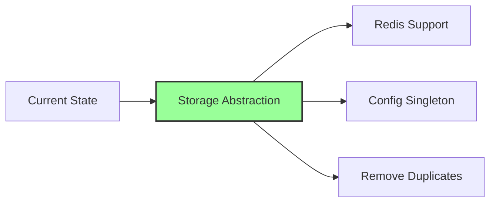

### Short-term (1-3 months)

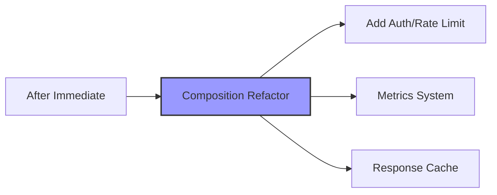

### Medium-term (3-6 months)

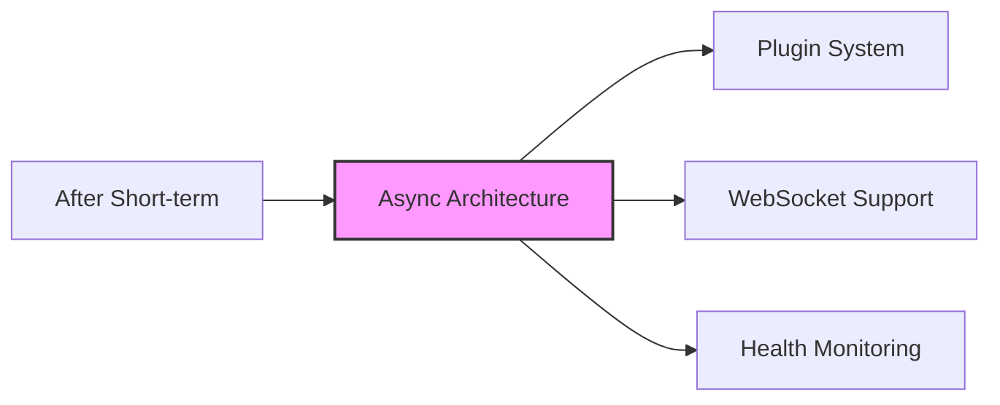

### Long-term Vision (6+ months)

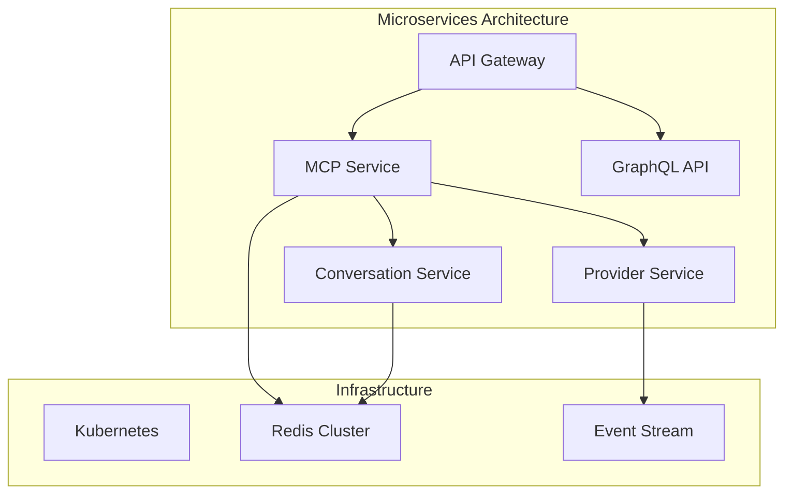

## Conclusion

The Zen MCP Server demonstrates solid architectural foundations with clear separation of concerns, extensible design patterns, and thoughtful abstractions. The stateless-to-stateful bridge via conversation memory is an elegant solution to MCP's limitations, though it introduces scalability constraints.

The architecture is well-suited for its current use case (single-instance Claude Desktop integration) but requires evolution for production deployments. The proposed storage abstraction would immediately address the most critical limitation while maintaining backward compatibility.

Key architectural wins:
- Clean three-layer separation
- Provider-agnostic tool design  
- Extensible patterns throughout
- Strong typing and documentation

Primary challenges:
- In-memory state storage
- Complex inheritance hierarchies
- Scattered configuration
- Limited observability

The modular design provides an excellent foundation for evolution while the clear abstraction boundaries enable incremental improvements without system-wide refactoring.

## Technology Stack

### Core Technologies

#### Python 3.10+ 
**Reasoning**: Modern Python features enable clean async support, type hints, and pattern matching. The MCP SDK requires Python 3.10+.

#### MCP (Model Context Protocol) SDK
**Library**: `mcp==1.3.2`  
**Purpose**: Protocol implementation for Claude integration  
**Reasoning**: Official Anthropic SDK ensures compatibility and protocol compliance

### Framework & Architecture Libraries

#### Pydantic v2
**Library**: `pydantic==2.10.4`  
**Purpose**: Data validation, serialization, and schema generation  
**Reasoning**: 
- Type-safe request/response models
- Automatic validation with clear error messages
- JSON Schema generation for MCP tool discovery
- Performance improvements in v2

#### httpx
**Library**: `httpx==0.28.1`  
**Purpose**: HTTP client with connection pooling  
**Reasoning**:
- Modern async-capable HTTP client
- Built-in connection pooling for provider efficiency
- Timeout and retry handling
- HTTP/2 support for better performance

### AI Provider SDKs

#### OpenAI Python SDK
**Library**: `openai==1.59.5`  
**Purpose**: OpenAI and OpenAI-compatible providers (DIAL)  
**Reasoning**:
- Industry standard for LLM interactions
- Supports OpenAI-compatible endpoints
- Streaming response support
- Well-maintained with regular updates

#### Google Generative AI
**Library**: `google-generativeai==0.8.3`  
**Purpose**: Gemini model integration  
**Reasoning**:
- Official Google SDK for Gemini
- Native support for Gemini-specific features (thinking mode)
- Handles multi-modal inputs (text + images)

### Development Tools

#### Testing Framework
**Libraries**:
- `pytest==8.3.4` - Test runner
- `pytest-asyncio==0.25.2` - Async test support
- `pytest-mock==3.14.1` - Mocking utilities

**Reasoning**:
- Pytest's fixture system enables clean test setup
- Async support crucial for protocol testing
- Rich assertion introspection
- Extensive plugin ecosystem

#### Code Quality
**Libraries**:
- `ruff==0.9.1` - Fast Python linter
- `black==24.10.0` - Code formatter
- `isort==5.13.2` - Import sorter
- `mypy==1.14.1` - Static type checker

**Reasoning**:
- Ruff combines multiple linters (flake8, pylint, etc.) with 10-100x speed
- Black ensures consistent formatting (no debates)
- Type checking catches errors early
- All tools work together harmoniously

### Utility Libraries

#### python-dotenv
**Library**: `python-dotenv==1.0.1`  
**Purpose**: Environment variable management  
**Reasoning**:
- Standard practice for configuration
- Supports .env files for local development
- Keeps secrets out of code

#### Pillow
**Library**: `Pillow==11.1.0`  
**Purpose**: Image processing for vision models  
**Reasoning**:
- De facto standard for Python image processing
- Supports all common formats
- Efficient base64 encoding for API calls

### Logging & Observability

#### Python Logging + RotatingFileHandler
**Built-in**: Standard library  
**Purpose**: Structured logging with rotation  
**Reasoning**:
- Zero dependencies for core functionality
- RotatingFileHandler prevents disk fill
- Structured logs enable parsing
- Compatible with any log aggregation system

**Configuration**:
```python
# 20MB max file size, 10 backups for server logs
# 20MB max file size, 5 backups for activity logs
```

### Architecture Patterns & Libraries

#### Singleton Pattern
**Implementation**: Custom `__new__` override  
**Used in**: ModelProviderRegistry  
**Reasoning**:
- Ensures single source of truth for providers
- Prevents duplicate API client initialization
- Thread-safe implementation

#### Abstract Base Classes
**Library**: `abc` (built-in)  
**Used in**: BaseTool, ModelProvider  
**Reasoning**:
- Enforces interface contracts
- Clear extension points
- IDE support for implementation checking

#### UUID Generation
**Library**: `uuid` (built-in)  
**Purpose**: Conversation thread identification  
**Reasoning**:
- Globally unique identifiers
- No coordination required
- URL-safe string representation

### Missing Technologies (By Design)

#### No Web Framework
**Reasoning**: MCP uses stdio, not HTTP. Adding Flask/FastAPI would add complexity without benefit.

#### No Database
**Current**: In-memory dictionaries  
**Reasoning**: Simplicity for initial implementation, though this limits scalability  
**Future**: Redis/PostgreSQL for persistence

#### No Message Queue
**Current**: Synchronous request/response  
**Reasoning**: MCP protocol is inherently synchronous  
**Future**: Could add for provider parallelization

#### No Container Orchestration
**Current**: Single process design  
**Reasoning**: Desktop integration focus  
**Future**: Kubernetes for cloud deployment

### Technology Decisions Matrix

| Component | Technology | Alternative Considered | Decision Reasoning |
|-----------|------------|----------------------|-------------------|
| Protocol | MCP SDK | Custom JSON-RPC | Official SDK ensures compatibility |
| Validation | Pydantic v2 | attrs, dataclasses | Schema generation, validation |
| HTTP Client | httpx | requests, aiohttp | Modern, connection pooling |
| Testing | pytest | unittest | Fixtures, async support |
| Linting | ruff | flake8, pylint | Speed, all-in-one |
| Formatting | black | yapf, autopep8 | Community standard |
| Images | Pillow | opencv-python | Lighter weight, sufficient |
| Config | python-dotenv | configparser | .env is standard practice |

### Performance Characteristics

#### Memory Usage
- Base: ~50MB Python interpreter
- Per provider: ~10-20MB (client libraries)
- Per conversation: ~1-5KB (metadata + turns)
- Images: Temporarily loaded, then gc'd

#### Startup Time
- Cold start: 2-3 seconds (import time)
- Provider init: Lazy (on first use)
- Tool discovery: <100ms (pre-computed)

#### Request Latency
- MCP overhead: <5ms
- Provider calls: 500ms-30s (model dependent)
- Memory operations: <1ms
- File I/O: Variable (size dependent)

### Security Considerations

#### Dependency Management
- All dependencies pinned to exact versions
- Regular security updates via Dependabot
- No use of deprecated libraries
- Minimal dependency tree

#### Secret Management
- API keys via environment variables
- No secrets in code or logs
- .env file in .gitignore
- Keys redacted in error messages

#### Input Validation
- All inputs validated via Pydantic
- Path traversal prevention
- File size limits for images
- Request size limits (MCP protocol)

### Technology Stack Layers

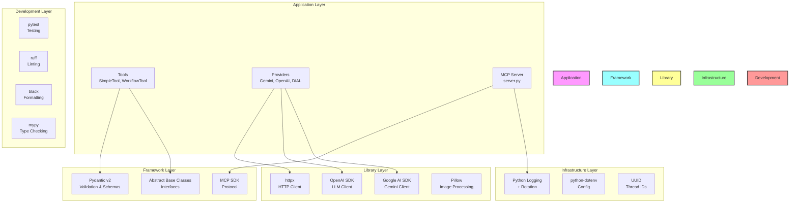

### Dependency Relationships

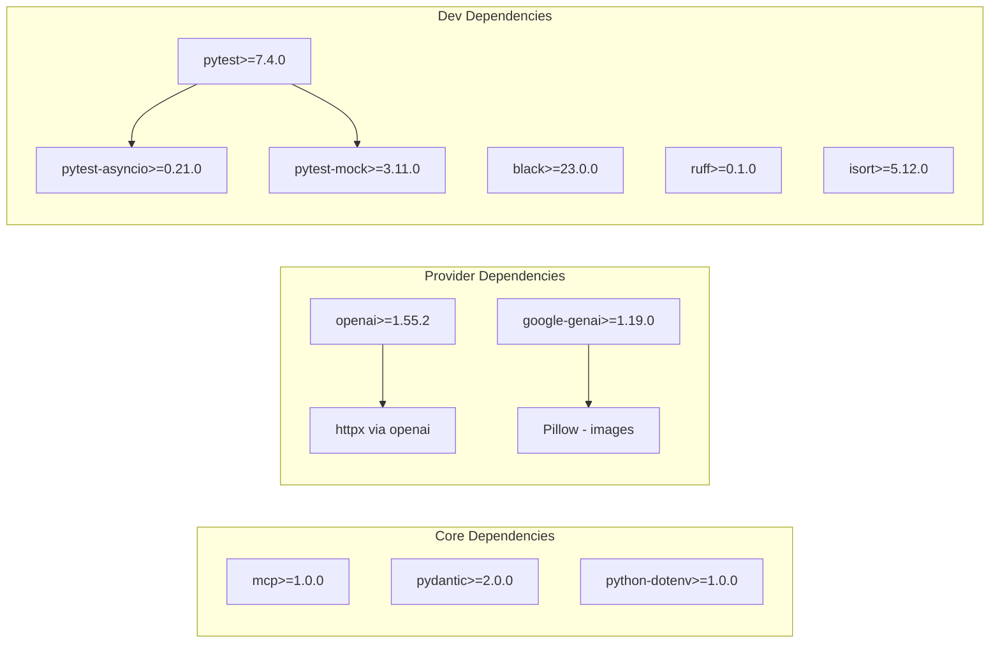

### Build & Deployment Tools

#### Shell Scripts
**Scripts**:
- `run-server.sh` - Setup and configuration
- `code_quality_checks.sh` - CI/CD quality gates
- `run_integration_tests.sh` - Integration test runner

**Reasoning**:
- Cross-platform compatibility (with WSL on Windows)
- Self-documenting installation process
- Automated environment setup
- Consistent developer experience

#### Virtual Environment Management
**Tool**: Python venv (built-in)  
**Location**: `.zen_venv/`  
**Reasoning**:
- No additional dependencies
- Standard Python practice
- Isolates project dependencies
- Works across all platforms

#### Configuration Management
**Files**:
- `.env` - Local environment variables
- `conf/custom_models.json` - Model configurations
- `systemprompts/` - System prompt templates

**Reasoning**:
- Clear separation of config from code
- Easy to customize without code changes
- Version control friendly (templates checked in)

### CI/CD Pipeline

```mermaid
graph LR
    subgraph "Local Development"
        Edit[Code Changes]
        Quality[./code_quality_checks.sh]
        Test[Unit Tests]
    end
    
    subgraph "Integration Testing"
        Integration[./run_integration_tests.sh]
        Simulator[Simulator Tests]
    end
    
    subgraph "Deployment"
        Setup[./run-server.sh]
        Config[MCP Configuration]
        Run[Claude Integration]
    end
    
    Edit --> Quality
    Quality --> Test
    Test --> Integration
    Integration --> Simulator
    Simulator --> Setup
    Setup --> Config
    Config --> Run
    
    style Quality fill:#9f9,stroke:#333,stroke-width:2px
    style Test fill:#9f9,stroke:#333,stroke-width:2px
    style Integration fill:#ff9,stroke:#333,stroke-width:2px
```

### Future Technology Considerations

#### Short-term Additions
- **Redis**: For conversation persistence
- **Prometheus client**: For metrics
- **structlog**: For structured logging
- **tenacity**: For advanced retry logic

#### Medium-term Evolution
- **FastAPI**: If adding REST API
- **SQLAlchemy**: For relational data
- **Celery**: For async task processing
- **OpenTelemetry**: For distributed tracing

#### Long-term Platform
- **gRPC**: For service communication
- **Kubernetes operators**: For deployment
- **Apache Kafka**: For event streaming
- **GraphQL**: For flexible querying